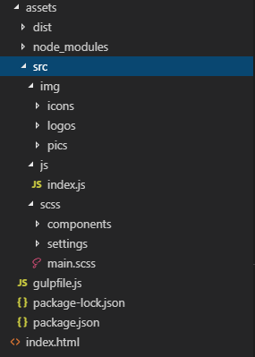
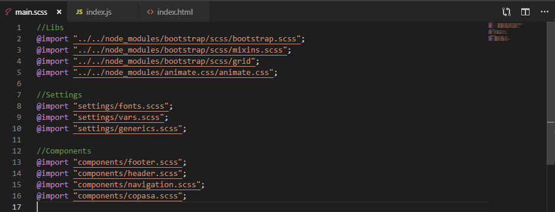
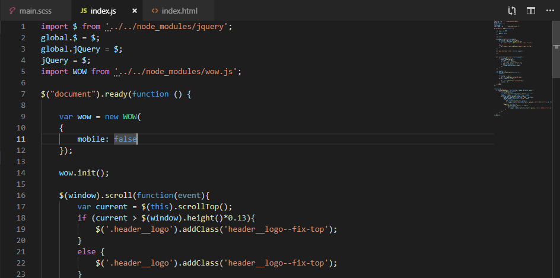
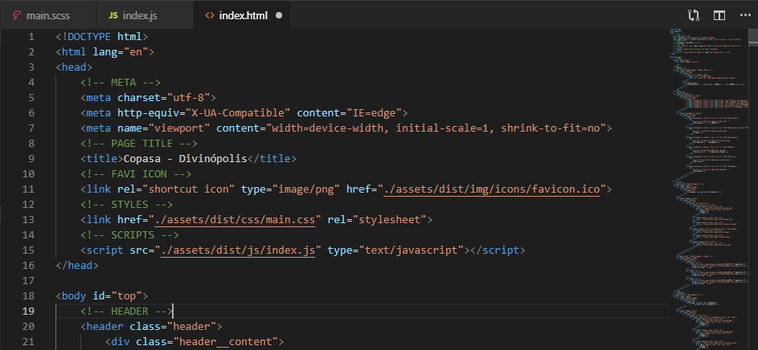

# Gulp Minify Config
A simple Gulp configuration to minify SASS, JS and Images.

## Getting Started
These files allow you to start a project with a basic minifier for SASS/CSS files, Java Script files and images files SVG, PNG, GIF and JPEG atomically using NPM and GULP.

### Prerequisites
Have [NPM and Node.js](https://pages.github.com/) installed.

### Installing
Clone or download this repo and add the contents of the folder **__pack__** in your project or assets folder.
Open your project/assets folder via command line and run:
```
npm install
```
To have Gulp watch your files for any change, run:
```
npm start
```

## Configuring 
### Paths
This project, as default, reads input files like this:
```
+-- src/
|   +-- img/
|   +-- js/
|   |   +-- index.js
|   +-- scss
|   |   +-- main.scss
```

And output the files like this:
```
+-- dist/
|   +-- img/
|   +-- js/
|   |   +-- index.js
|   +-- css
|   |   +-- main.css
```
You can change these paths in the **gulpfile.js**, in the lines that contains **__gulp.src()__** and **__gulp.dest()__**.

### Tasks
Now, every time you save the **index.js**, **main.css** or change any file inside the **__img__** folder, Gulp will run it's respective task:
```
    gulp.watch("./src/img/**/**", gulp.series('imgTask')); //for minifying images
    gulp.watch("./src/scss/**/*.scss", gulp.series('sassTask')); //for minifying sass
    gulp.watch("./src/js/**/*.js", gulp.series('jsTask')); //for minifying js
```

A side down effect is that every time you save a single file, the task will run it's respective task on **ALL files inside src folder**, what is a normal thing for __js__ and __scss__ since it generates a single file made of all other js or scss files. 

But for the images that's totally unnecessary, because the number of files remains the same after being minified, so in a machine with a low processing speed or with low memory, that can be a hassle, because it may freeze your machine while doing the image task.

So, if you see fit, comment the line:
```
//gulp.watch("./src/img/**/**", gulp.series('imgTask'));

```
in the **gulpfile.js**, change your image files and when you finished, remove the comment and run npm start again, change a single image to trigger the __imgTask__ and compile all the images at once.

## How to use
As you can see in the --gulpfile.js--, there are only one file as source for the __scss__ and __js__ files, so to import a library or some other code, you need to do it **INSIDE these two files!**

For JS:
```
import $ from '../../node_modules/jquery';
//or
import '../myScript.js';
```

For SCSS:
```
@import "../../node_modules/bootstrap/scss/bootstrap.scss";
```
This way you only need to import these two files in your HTML:
```
    <!-- STYLES -->
    <link href="/dist/scss/main.css" rel="stylesheet">
    <!-- SCRIPTS -->
    <script src="/dist/js/index.js" type="text/javascript"></script>
```
Now we can just deploy only the folder __dist__ to production, leaving all the innumerous source codes files and node modules behind.

## Example
This section will show the structure of a single page I made for a client.

### The src folder structure:


### The main.scss imports:


### The index.js imports:


### The html imports:


### Running


The time of these tasks may vary from project to project and pc to pc, but the first compilation of each task usually takes more time to run. 

## Contributing
Please read create your own branch of this repo and then send me a msg describing your changes.

## Authors
* **Laura San Martin (me lol)**  [LaurexSan](https://github.com/laurexsan)
